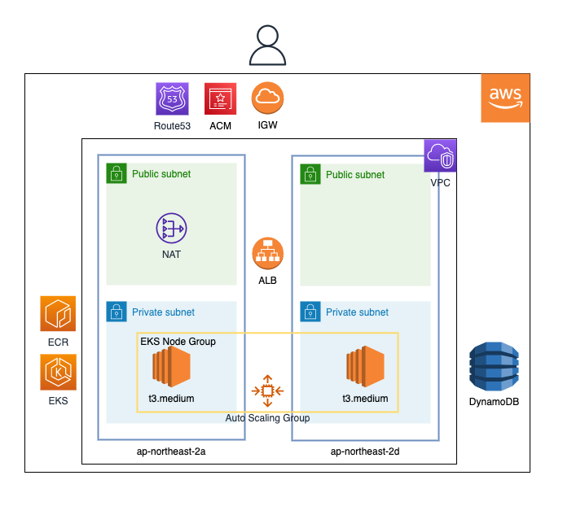
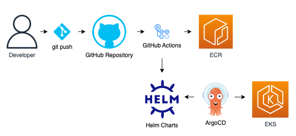
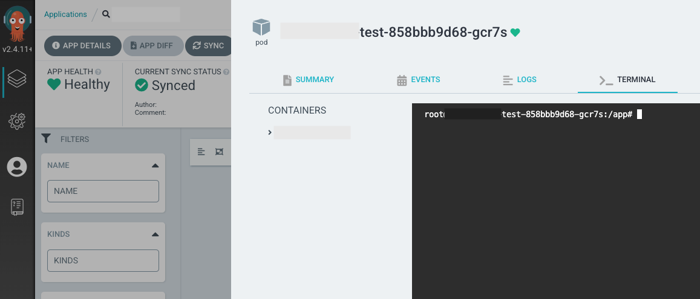

<h1 align="center">django-dynamodb-eks</h1>

Django를 사용하여 AWS DynamoDB에 데이터를 저장하는 예제입니다. GitHub Repository에 git push하면 github actions 스크립트가 프로젝트의 Docker 이미지를 만들어서 ECR에 Push하고, Helm Chart의 이미지 태그를 수정합니다. ArgoCD는 바뀐 이미지 태그를 기반으로 Sync를 맞추어 EKS에 배포하게 됩니다. 

# Table of contents

* [구성도](#구성도)
  * [AWS](#aws)
  * [CI/CD](#cicd)
* [EKS 생성](#eks-생성)
* [Django 프로젝트 만들기](#django-프로젝트-만들기)
* [EKS - Addon, deployment, service, ingress](#eks---addon-deployment-service-ingress)
* [Helm Chart](#helm-chart)
* [ArgoCD](#argocd)
* [Demo](#demo)
* [License](#license)

# 구성도

### AWS



* NAT를 생성, Private Subnet을 구성하고, 그 안에 EKS Node Group이 생성한 EC2가 생성됩니다. 
* 프로젝트의 이미지를 Elastic Container Registry(private)에 저장합니다. 
* EKS로 kubernetes control plane을 생성하고, 노드그룹 옵션으로 Woker Node를 만듭니다. 
* EKS Ingress resource가 ALB를 생성, Route53에 도메인을 등록합니다. 사용자는 Route53, IGW, ALB를 통해 서버로 들어오게 됩니다.
* IAM Role이 맵핑된 EKS ServiceAccount 권한으로 POD에서 AWS DynamoDB로 접근하여 데이터를 저장합니다.
* Route53에 도메인을 등록하고, Certificate Manager를 통해 SSL 인증서를 발급받아 연걸합니다.

### CI/CD



* GitHub Repo에 Push를 하게되면 GitHub Actions이 Dockerfile를 읽고 이미지를 만듭니다. 
* 만들어진 이미지의 태그를 GitHub Action이 Helm Chart의 values.yaml에 업데이트합니다. 
* ArgoCD는 GitHub Repository의 Helm Chart를 바라보면서 주기적으로 sync합니다. 
* 태그가 바뀌면 replicaset의 버전이 올라가면서 새로운 버전이 배포됩니다. 

# EKS 생성

[(Back to top)](#table-of-contents)

* IAM 사용자로 AWS Console에서 만들었습니다. 
  * Control Plane IAM Role 생성
  * EKS Cluster Control Plane 생성
  * Node Group IAM Role 생성
  * Node Group 생성
  * 참고 사이트
    * [aws eks create cluster](https://docs.aws.amazon.com/ko_kr/eks/latest/userguide/create-cluster.html)

# Django 프로젝트 만들기

[(Back to top)](#table-of-contents)

* [Django with a DynamoDB backend](https://github.com/dotja/django-dynamodb-backend) Repository를 사용합니다.
* 테스트를 하는 과정에서 python 모듈 버전이 기존 Repo와 맞지 않아 marshmallow라는 모듈의 버전을 조정했습니다. 
* local dynamoDB를 docker 컨테이너로 하나 띄운뒤에 django 프로젝트에서 credential 변수를 설정하여 데이터가 들어가는지 테스트했습니다. 
* Dockerfile, .env, entrypoint.sh, requirements.txt파일을 추가로 작성했습니다. 
* home.html파일을 기호에 맞게 수정하여 사용했습니다.
* django 내부 웹서버를 사용하지 않고, gunicorn을 사용하도록 Dockerfile을 작성했습니다. 
* 환경변수들을 분리하여 파일을 통해서 주입했습니다(os.get.viron()).
  * EKS에서는 해당 파일을 기반으로 시크릿 오브젝트를 만들어서 주입합니다.
* GitHub Repository에 push하면 Dockerfile을 기반으로 이미지를 만들어 ECR에 푸시하는 GitHub Actions 스크립트를 작성했습니다. 
* 참고 사이트
  * [dynamodb with django](https://www.youtube.com/watch?v=pfPLYuWDlvM)
  * [Deploy Django into Production with Kubernetes, Docker, & Github Actions. Complete Tutorial Series](https://www.youtube.com/watch?v=NAOsLaB6Lfc)

# EKS -  Addon, deployment, service, ingress 

[(Back to top)](#table-of-contents)

* Service, Ingress 리소스와 AWS Load Balancer를 맵핑시켜주는 aws-load-balancer-controller addon을 설치했습니다. 
* Route53에 도메인을 자동으로 등록 및 업데이트하고, Certificate Manager로 ssl redirect를 해주는 External DNS addon을 설치했습니다. 
* k8s deployment, service, ingress 스크립트를 작성했습니다. 
  * Subnet Auto Discovery를 위해 Private Subnet에 특정 태그를 추가해줬습니다. 
  * Pod에서 aws dynamodb에 접근해야 하기 때문에 iam role 기반의 serviceaccount를 만들고, deployment의 spec.template.spec.serviceAccountName에 명시해줬습니다. 
  * ingress를 작성할 때 certificate-arn, hostname 등을 작성해서 443 port로 ssl redirect 되도록 작성했습니다. 
* 참고 사이트
  * [Subnet Auto Discovery](https://kubernetes-sigs.github.io/aws-load-balancer-controller/v2.3/deploy/subnet_discovery/)
  * [enable iam role for serviceaccount](https://docs.aws.amazon.com/ko_kr/eks/latest/userguide/enable-iam-roles-for-service-accounts.html )
  * [ALB Controller vs Nginx Controller](https://itnext.io/kubernetes-ingress-controllers-how-to-choose-the-right-one-part-1-41d3554978d2)
  * [ALB Controller](https://docs.aws.amazon.com/ko_kr/eks/latest/userguide/aws-load-balancer-controller.html)
  * [External DNS Install](https://github.com/kubernetes-sigs/external-dns/blob/master/docs/tutorials/aws.md)
  * [pod level access to dynamodb using iam on amazon eks](https://cmani.medium.com/pod-level-access-to-dynamodb-using-iam-on-amazon-eks-eeabd5460cb6)

# Helm Chart

[(Back to top)](#table-of-contents)

* k8s의 기본 스크립트를 그대로 활용하고 간단하게 image의 tag만 변수로 지정해서 helm으로 k8s 스크립트를 패키징했습니다. 
* ECR에 새롭게 push되는 이미지들의 태그를 자동으로 helm chart의 values.yaml에 업데이트하는 github actions 스크립트를 작성했습니다. 
* 참고 사이트
  * [helm tutorial](https://youtu.be/ajcyC_6velc)
  * [GitOps: CI/CD using GitHub Actions and ArgoCD on Kubernetes](https://levelup.gitconnected.com/gitops-ci-cd-using-github-actions-and-argocd-on-kubernetes-909d85d37746)

# ArgoCD

[(Back to top)](#table-of-contents)

* 같은 클러스터 내에 ArgoCD를 설치했습니다. 
* Service 오브젝트를 NodePort 타입으로 변경하고, 직접 Ingress 오브젝트를 작성하여 도메인과 연결된 ALB를 생성했습니다. 
* ArgoCD내 pod의 Terminal 기능 사용을 위해서 configmap, clusterrole을 수정했습니다.
* 참고 사이트
  * [argocd install](https://argo-cd.readthedocs.io/en/stable/getting_started/)
  * [ingress](https://nyyang.tistory.com/114)
  * [pod terminal](https://argo-cd.readthedocs.io/en/stable/operator-manual/web_based_terminal/#enabling-the-terminal)

# Demo

[(Back to top)](#table-of-contents)

* Demo Site가 나오고, Insert data into AWS DynamoDB를 클릭합니다. 
* Name, Diet, Email을 입력하고 Submit 버튼을 누릅니다. 무조건 입력해야하며, Email은 형식에 맞게 써야합니다. 
* DynamoDB 데이터 확인

  * 아무 Pod를 눌러 Terminal에 접속합니다. 
  * 
  * terminal에 아래 명령어를 입력합니다. 
  * ```python
    $ /opt/venv/bin/python3.10 # 가상환경 python cosole 접속
    >>> import boto3, json # 패키지 import
    >>> print(json.dumps(boto3.resource('dynamodb').Table("my-table").scan(), ensure_ascii=False, indent=3)) # json형식으로 dynamodb 데이터 출력
    ```

# License

[(Back to top)](#table-of-contents)

The MIT License (MIT) 2022 - [PARKINHYO](https://github.com/PARKINHYO/). Please have a look at the [LICENSE](./LICENSE) for more details.
